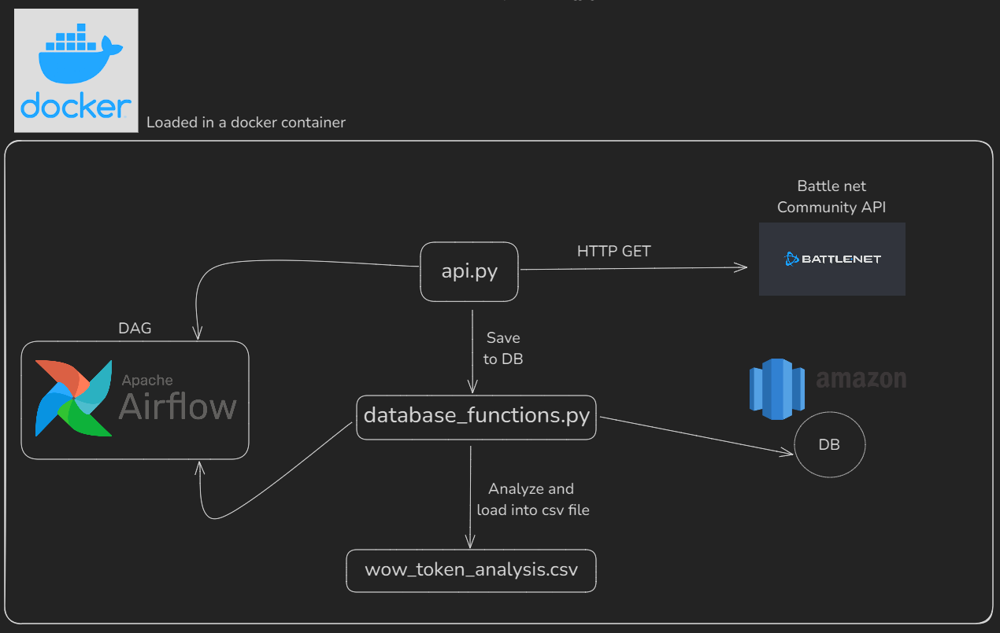

# WOWTPC | World of Warcraft Token Price Check

WOWTPC es un DAG que utiliza una API gratuita la comunidad de [Blizzard/BattleNet](https://us.shop.battle.net/es-es) sobre el juego MMORPG [World of Warcraft](https://worldofwarcraft.blizzard.com/es-es/). El DAG busca diariamente el endpoint de `/token/history/us/` para saber el precio de cada dia del WoW Token en la region de US (Estados Unidos) del juego.

## ¿Que es un WoW Token?

Dado que el World of Warcraft es un juego que se paga mensualmente, se creo el "wow token" para permitir a los jugadores intercambiar oro (_moneda principal del juego_) por una **wow token**. Estos tokens pueden ser utilizados para conseguir 1 mes adicional de juego.
Es importante aclarar que el precio que se ve en el analisis en **su valor en oro**.
El WoW tiene 3 monedas principales:

- Cobre
- Plata
- Oro

Como se menciono anteriormente, al ser el oro la moneda principal, es importante saber su precio en ese formato.

# Componentes principales del DAG

## wow_token_dag.py

Modulo donde se almacenan las instrucciones y configuraciones de cada Task y el orden de ejecucion

## api.py

Modulo donde se interactua con la API de Battle Net para buscar el precio de los wow tokens actual.
Se encarga de comunicarse con la API y obtener cada fecha correspondiente a la ejecucion diaria del DAG, de esa manera, obtengo la diferencia de precio para comparar si el valor del token subio o bajo (-).

## database_functions.py

Modulo que tiene la interaccion con la base de datos, es como el repository de la aplicacion.
Se encarga de realizar:

- Insercion de datos
- Procesar y analizar informacion
- Generar el `.csv` correspondiente

Esto se realiza mediante la conexion a `custom-db`, el cual es un postgres 16 creado en el `docker-compose.yaml`.

# Pre-requisitos

- Tener docker instalado

# Como levantar la aplicacion

1. Clonar el repositorio: `git clone https://github.com/lucaspiritogit/dag-wow-token-price-check`
2. Entrar a la carpeta del repositorio clonado
3. Crear un archivo `.env` (_no es necesario poner ninguna credencial dado que la API es de la comunidad hecho por BattleNet_) en la raiz del proyecto para que se genere al AIRFLOW_UID.
4. En la terminal de preferencia, ejecutar: `docker compose up --build`
5. Al finalizar la ejecucion del docker, abrir un navegador en modo incognito y dirigirse a http://localhost:8080
6. Ingresar al airflow con las siguientes credenciales:
   1. user: airflow
   2. pass airflow
7. En el caso de que este pausado, despausar el DAG para que comience la ejecucion.
8. Ademas de poder observar el DAG, se puede obsevar el archivo csv en la carpeta raiz `output/wow_token_analysis.csv` para la carga de los datos transformados.

# Resultado

La ejecucion del DAG va desde el 2024-09-19 hasta el 2024-10-19 (_1 mes_) de manera diaria, se encarga de crear el archivo `wow_token_analysis.csv` en la carpeta `/output` en tiempo real basado en un dataframe hecho en pandas. El .csv tiene la diferencia de precio en oro de cada dia para ver si subio o bajo.
